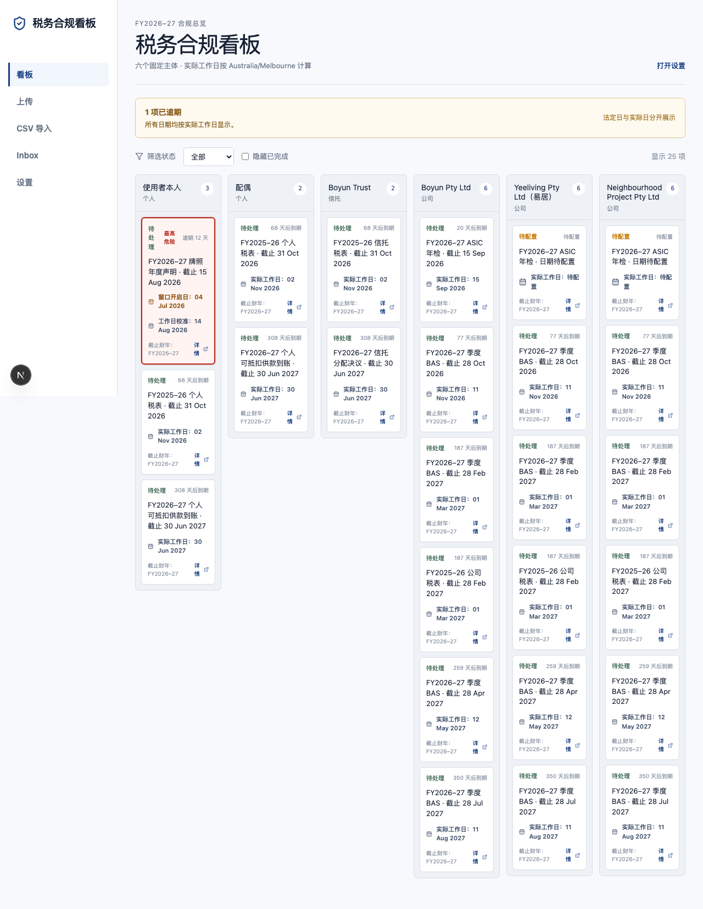

# Gate 2 运行证据

运行日期：2026-08-26

数据库：`./data/app.db`

本轮回归结果：`tests/unit/obligation-state.test.ts` 3/3、`tests/unit/reminders.test.ts` 2/2；全量 Vitest 17/17 个文件、72/72 个测试通过。

## blocked 与提醒回归

- `yeeliving_co` 与 `neighbourhood_co` 的 BAS 和公司税表不再继承 ASIC 的 `blocked`；只有各自 ASIC 年检义务在缺少 `asic_review_date` 时为 `blocked`，两个日期字段保持 `NULL`。
- blocked 的 ASIC 年检不生成提醒；同一主体的 BAS 仍生成 T-30、T-10、T-3、当天提醒。
- 规则依赖关系由 `obligation_rules.required_fields` 声明，状态按义务逐条计算。

## CSV 日期格式

映射向导提供 `DD/MM/YYYY`（默认）、`YYYY-MM-DD`、`MM/DD/YYYY` 三种选择；选择值随银行模板写入 `csv_mapping_templates.mapping_json.dateFormat`。预览区会按所选格式解析，并固定显示为 `DD MMM YYYY`。全量导入前会再次校验日期；解析失败、月份超过 12 或格式不匹配时阻止导入并提示可能选错格式。

同一输入 `03/04/2026` 的单元测试覆盖：

- `DD/MM/YYYY` → `03 Apr 2026`，FY2025–26 的 Q4；
- `MM/DD/YYYY` → `04 Mar 2026`，FY2025–26 的 Q3。

## 去重键

实际键为：`SHA-256(按列名排序的完整原始 CSV 行，包含描述) + 解析后的 date + amountCents`。因此同日同额但描述不同的交易不会被标为 duplicate；完整相同的行会被标记，且不会静默丢弃。

## 录入与证据边界

- CSV、文件、手动录入和邮箱 multipart/base64 入口均保留在本地 Inbox 流程；金额始终以整数分处理。
- 已验收 Gate 的证据文件不由 Gate 2 测试写入。Gate 2 自有截图均写在 `docs/evidence/gate2/`。
- 自动化只验证桌面流程与窄屏响应式布局；真实手机拍照、摄像头权限和手机系统上传流程未由自动化验证，留待用户现场验收。

## 自动化命令

- `npm run lint`：通过。
- `npm run build`：通过。
- Gate 0：3/3 浏览器测试通过；Gate 1：3/3；Gate 2 CSV：1/1；Gate 2 上传/邮箱：2/2；Gate 2 Inbox：1/1。
