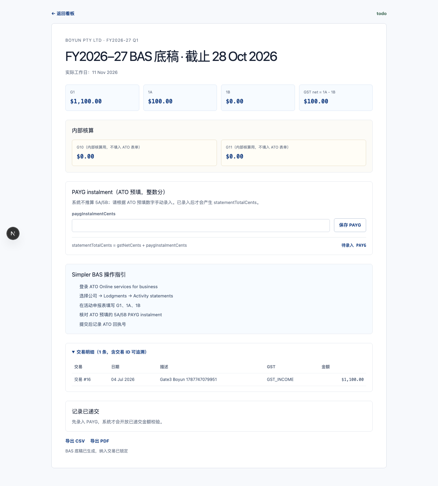

# Gate 3 运行证据

运行日期：2026-08-26
数据库：默认 `./data/app.db`（Gate 3 E2E 使用该数据库；结束后已清理测试夹具）

## 关键测试结果

- `tests/unit/gst-bas-mapping.test.ts`：11/11 通过；覆盖 GST_INCOME、GST_FREE_INCOME、INPUT_TAXED、GST_EXPENSE、GST_CAPITAL、NO_GST、PRIVATE、整数分、警告和 PAYG 总额。
- `tests/unit/bas-instructions.test.ts`：1/1 通过；指引卡包含 G1、1A、1B，不包含 G10/G11。
- `tests/unit/bas-generator.test.ts`：4/4 通过；覆盖原子生成/回滚、交易锁定与快照、PAYG 与 `statementTotalCents` 校验、nil BAS。
- 全量 `npm test`：20/20 个测试文件、88/88 个测试通过。
- `npm run lint`：通过。
- `npm run build`：通过。
- `npm run test:e2e -- tests/e2e/gate3-bas.spec.ts`：1/1 通过。

## BAS 运行结果

本轮浏览器流程为三家公司生成 FY2026–27 Q1：

| 主体 | worksheet ID | 结果 | 交易快照 | PAYG | statement total |
|---|---:|---|---:|---:|---:|
| Boyun Pty Ltd | 10 | 已递交 | 16 | 2,500 分 | 12,500 分 |
| Yeeliving Pty Ltd（易居） | 11 | 底稿就绪 | 17 | 未录入 | 待录入 |
| Neighbourhood Project Pty Ltd | 12 | nil BAS | 0 | 未录入 | 待录入 |

三家公司均使用同一套 Simpler BAS 指引；操作指引只列 G1、1A、1B。G10/G11 仍保存在内部核算区，并明确标注“内部核算用，不填入 ATO 表单”。Boyun 的已递交金额按 `statementTotalCents = gstNetCents + paygInstalmentCents` 校验，12,500 分匹配后才成功记录 ATO 回执。

生成操作在单个 SQLite transaction 内完成校验、汇总、快照、worksheet 写入、义务状态更新和交易锁定；存在待确认交易时会整体回滚。nil 路径生成全零底稿并显示递交 nil activity statement 的提示。

## 导出与日期

- CSV 与 PDF 导出均使用 `DD MMM YYYY` 日期；CSV 浏览器测试断言包含 `04 Jul 2026` 且不包含 `2026-07-04`。
- PDF：A4、1 页、PDF 1.4；已用 `pdftoppm` 渲染并人工检查，内容包含 `28 Oct 2026`、`11 Nov 2026`、`04 Jul 2026`，没有 ISO 日期或美式日期。当前环境的 `pdftoppm` 输出了 Fontconfig 配置缺失警告，但仍成功生成可读 PNG。
- BAS 底稿截图与 PDF 均位于 `docs/evidence/gate3/` 或 `output/pdf/`；没有覆盖 Gate 0–2 证据文件。

## 浏览器边界

在本地运行实例上用 390×844 窄屏检查了看板与 BAS 底稿页：文档宽度等于视口宽度、无横向溢出、指引和金额区可见，控制台无 error/warning。未声称验证真实手机拍照、摄像头权限或手机系统上传流程。

Gate 3 已完成并停在此处，未开始 Gate 4，等待用户验收。
